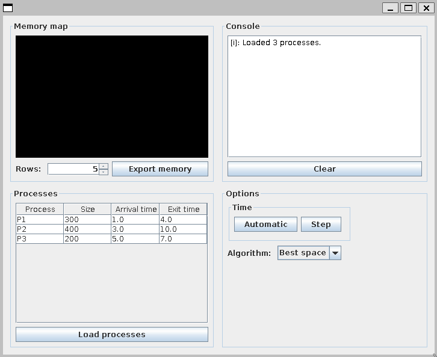

# Memory simulator

Memory simulator is a project I did during my degree. It is a visual implementation to show how processes are arranged in memory as they start and end using two different memory distribution algorithms: best space and next space.

## Requirements

- Java 21
- Maven 3.8.2

## Writing a file with a list of processes to run
To load processes into the program, a file with a row per process must be loaded. Each row of the file must have the format

`<process name> <entry time> <size in memory> <duration>`

In the `examples` folder there are some files provided to try the program.
